# 基于Simulink/RoadRunner的3D-HD map建图仿真和深度语义地图生成

>本Repo基于Simulink/RoadRunner构建了一个HD map，高逼格近似3D地图，可用于Scenario各种工况下的仿真，包括但不限于车位检测，车道线检测，可行驶区域检测，交通标志检测等一体的高度融合环境。地图格式支持导出AutoCAD®, Filmbox, glTF™, OpenFlight, OpenSceneGraph, ASAM OpenDRIVE®, USD, Apollo, CARLA, Metamoto®, Unity®, Unreal®, GeoJSON, and VTD等各类格式。

[RoadRunner®](https://www.mathworks.com/help/roadrunner/index.html)可根据`OpenStreetMap`、`Apollo HD Map`、`HERE HD Live Map`等导入地图数据或者直接从头开始逐一搭建，本项目所有3D目标均手工搭建，地图地面信息表达充分，特别是泊车位尽可能与实际表达一致，道路路面材质几乎与实际保持一致，通过自主/算法设计路线泊车，另外还可以根据速度profile+ego/non-ego vehicle自定制动态场景仿真+碰撞检测，高度逼近任意Scenario，适合各类感知算法corner case测试、深度学习groundTruth数据生成，也可以为下游的规控算法提供支持。

## Requirements

MathWorks Products (<https://www.mathworks.com>)

- Requires MATLAB release R2023b or newer.
- Simulink™
- Automated Driving Toolbox™.
- RoadRunner™
- RoadRunner Asset Library™
- RoadRunner Scenario™
- Sensor Fusion and Tracking Toolbox™ or Navigation Toolbox™ or UAV Toolbox™,([waypointTrajectory](https://www.mathworks.com/help/nav/ref/waypointtrajectory-system-object.html))
- Navigation Toolbox™ or Robotics System Toolbox™ or UAV Toolbox™,([quat2rotm](https://www.mathworks.com/help/nav/ref/quat2rotm.html))

Optional Products(<https://www.mathworks.com>)

- Deep Learning Toolbox™
- Computer Vision Toolbox™

## 工业厂区3D场景图一角（Scene）

由于地图是3D格式，为方便在此处一览，摘取了部分视角图像进行浏览如下，**源文件**位于`Scenes/IndustryZone.rrscene`，需要可前往下载。

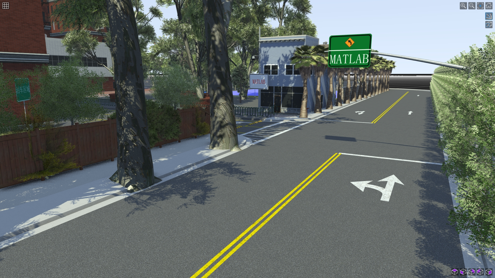
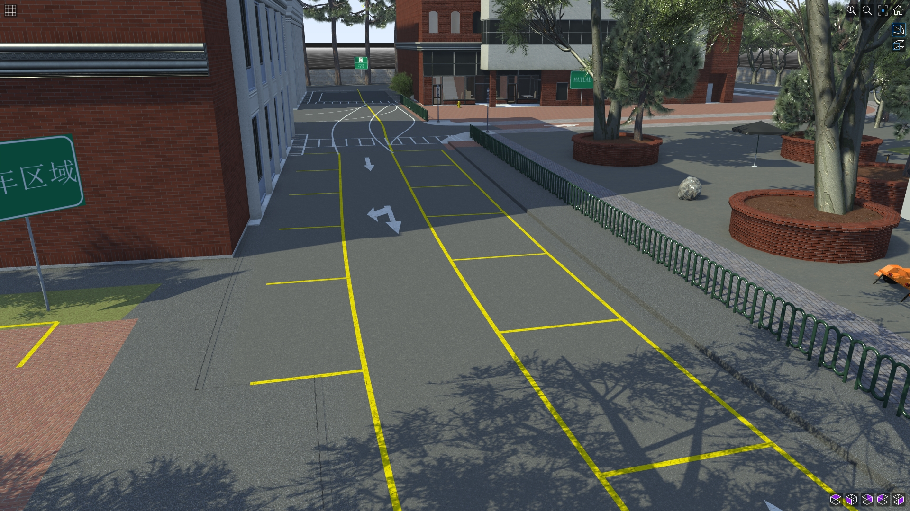
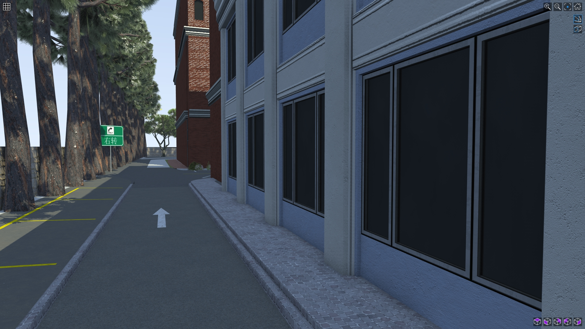

## 记忆泊车仿真(Scenario)

Scenario为动态设计的场景逻辑，源文件位于`Scenarios/IndustryZone.rrscenario`，需要可前往下载。该场景设计了从工业区侧边一条路东北门进入到U型广场泊车，红色泊车道路全长448.11米，在泊车区域内人为任意布置17辆不同车型，外观，位置的车辆。并设计一辆SUV为ego vehicle,车速3米/秒，视角选择"follow"，图像生成如下：
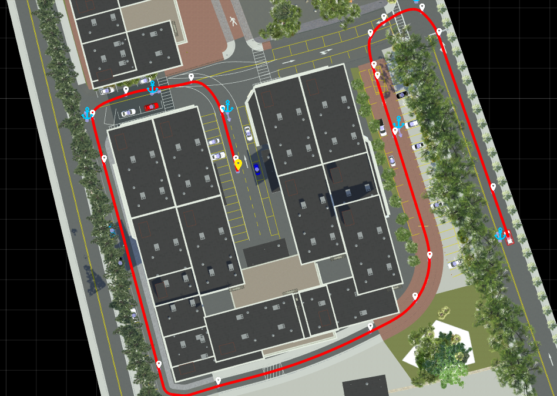
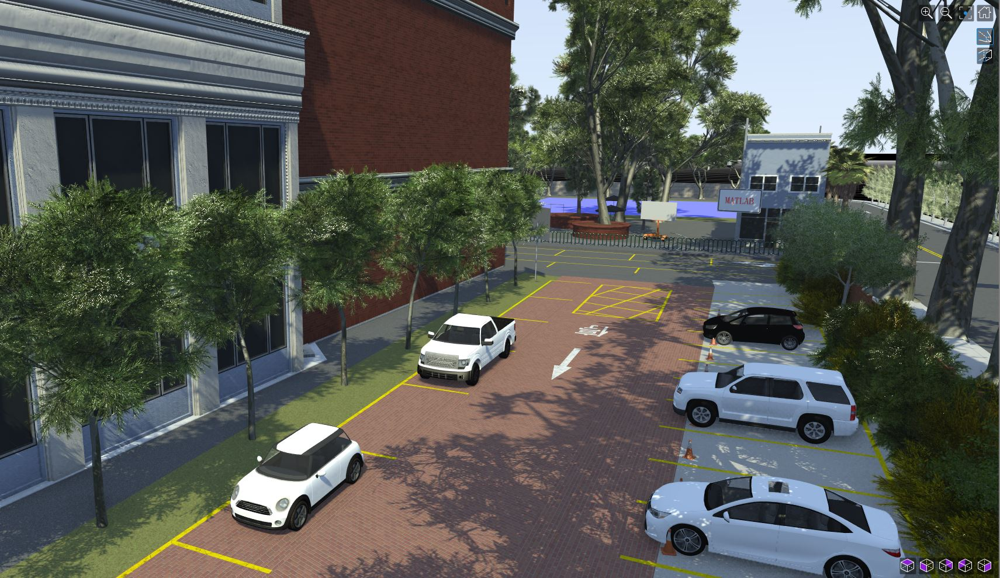

## 深度语义地图生成

上述Scenario动态产生的场景可直接联合Simulink仿真生成语义地图数据，为简化地图映射表示说明，只对环形道路一圈(约350米)进行语义地图映射，对不同路段的路面尽可能用原始材质表示，不同车位及先前已经停好的各类车。这里仅**搭建简易的Simulink模型**如下所示：

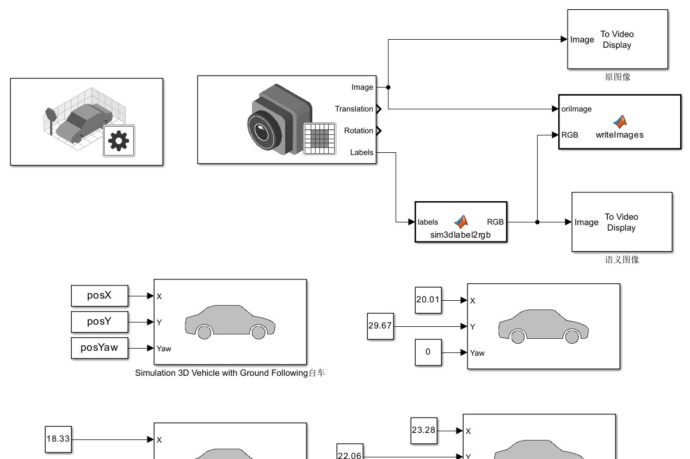

1. 选取waypoints

针对ego vehicle在BEV地图上选取waypoints并导入到MATLAB中生成trajectory，设计以经过所有waypoints的匀速行驶，到达各个waypoints时间可以自动推理计算得到。

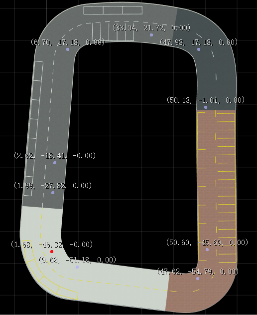

在MATLAB中绘制的轨迹路线如下：
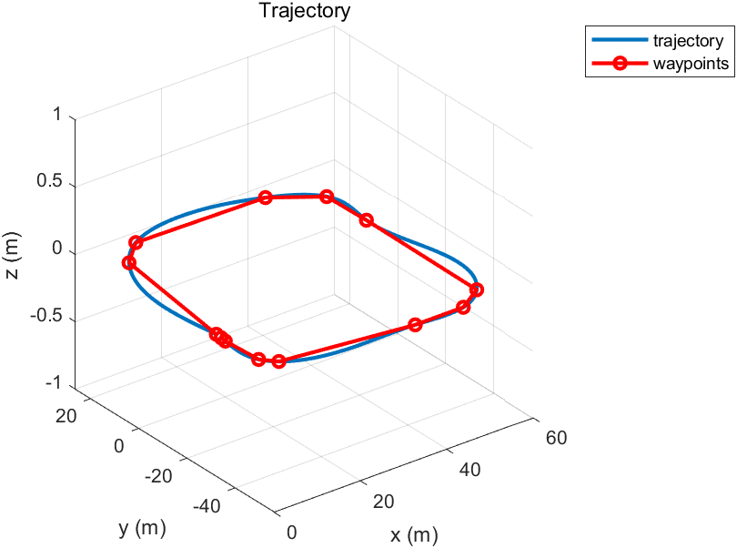

2. 布局各类已经停好的车

设计若干不同车类型，颜色，泊车位停放的车辆，见下图：
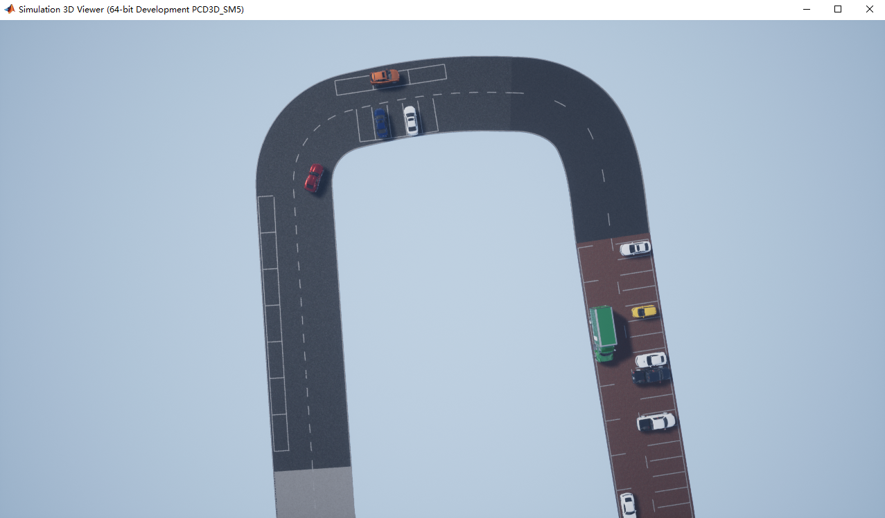

3. 语义映射地图

以下为仿真的地图原图和映射实时对比。
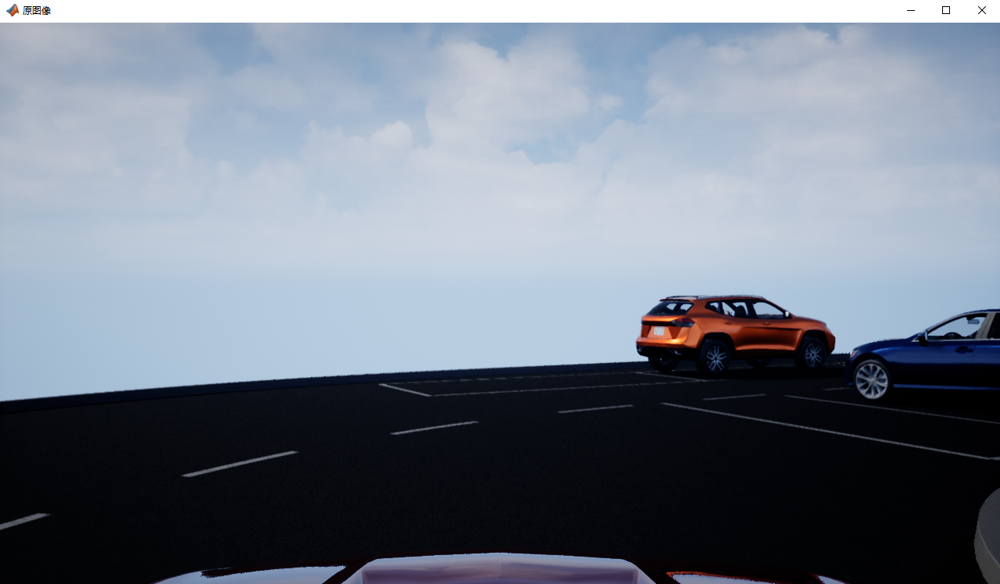
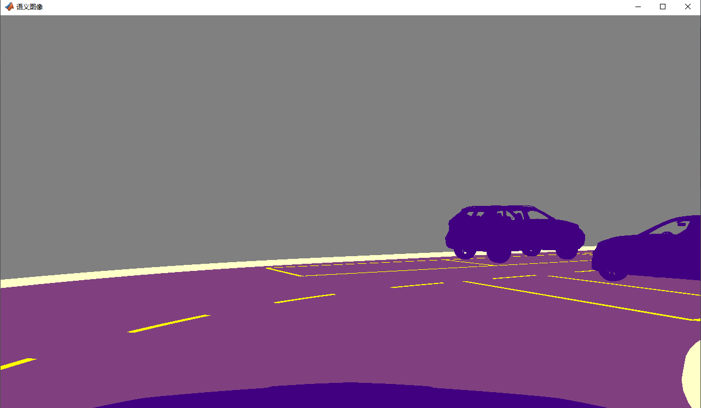

再看下俯视图BEV地图映射效果：

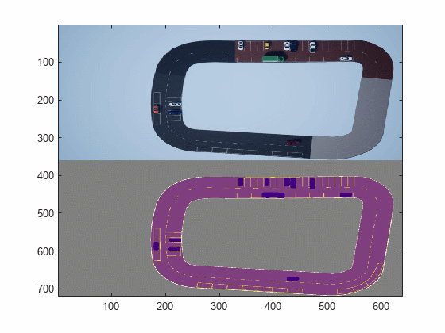

大量在任意视角下适用各类场景的深度学习语义图片可根据自己需求进行更改，上述简单模型产生的语义图片在`writeimages`模块下设置。
